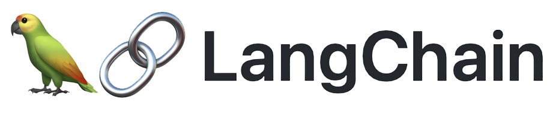

# Table of Contents

1. [About Project](#about-stock-sage-ai)
2. [How it Works](#how-it-works)
3. [TechStack](#techstack)
4. [Requirements](#requirements)
5. [Downloading the Repo](#downloading-the-repo)
6. [Setting Up Backend](#setting-up-backend)
7. [Setting Up Frontend](#setting-up-frontend)
8. [Starting the Webapp](#starting-the-webapp)
9. [Import Notice](#import-notice)

## About Stock Sage AI

Sage AI is an intelligent system designed to assist new investors in navigating the complex world of the stock market. By analyzing stock news and market trends, Sage AI provides valuable insights into the current scenario and sentiment surrounding various stocks. The web application is powered by data from [YouData.ai](https://www.youdata.ai/home), ensuring that our insights are both accurate and up-to-date. Investors can engage in conversations with Sage AI to gain deeper insights and clarify any doubts they may have. Our goal is to simplify the investment process and empower users with the knowledge they need to make informed decisions.

## How it Works

## TechStack

Here are the technologies used in this project:

<p align="center">
  
  
  
  
  
  
</p>

## Requirements

- **Python**: Version 10.3 or above
- **React**: With Vite
- **MongoDB**: Required for database management

## Downloading the Repo

Download the repository and extract it or clone the repository using the following command:
```bash
git clone https://github.com/Abhimanyu004/Stock_Sage_AI.git
```

## Setting Up Backend

go to the backend folder using the following command:
```bash
cd backend
```
create a python virtual environment and activate it using the following commands in the command prompt:
```bash
python -m venv env
.\env\Scripts\activate.bat
```
Now install the required libraries in the requirements.txt file using the following command:
```bash
pip install -r requirements.txt
```
!! if there are any error while downloading the libraries, upgrade pip and try again!!

## Setting Up Backend

go into the frontend using the following command:
```bash
cd forntend
```
install the required react libraries using the following command: **make sure you have npm and node installed**
```bash
npm install
```

## Stating the webapp
open two terminal side to side, one for the flask server and the other for the react frontend and run the following command:

./Stock_Sage_AI/backend
```bash
flask run
```
./Stock_Sage_AI/frontend
```bash
npm run dev
```

## Import Notice

**While running the app for the first time, it may download and install safe-tensors for 2.5gb, it only happens first time.**
